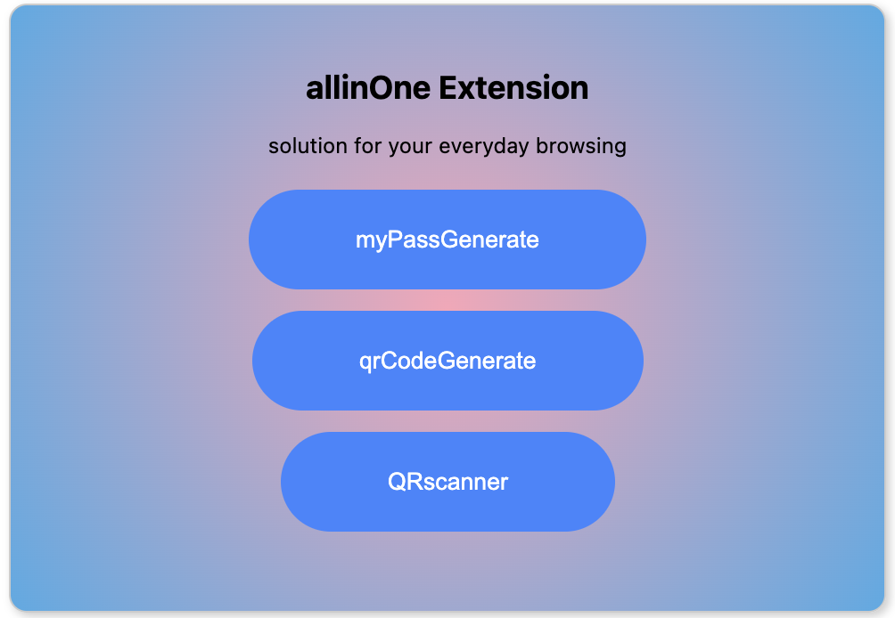
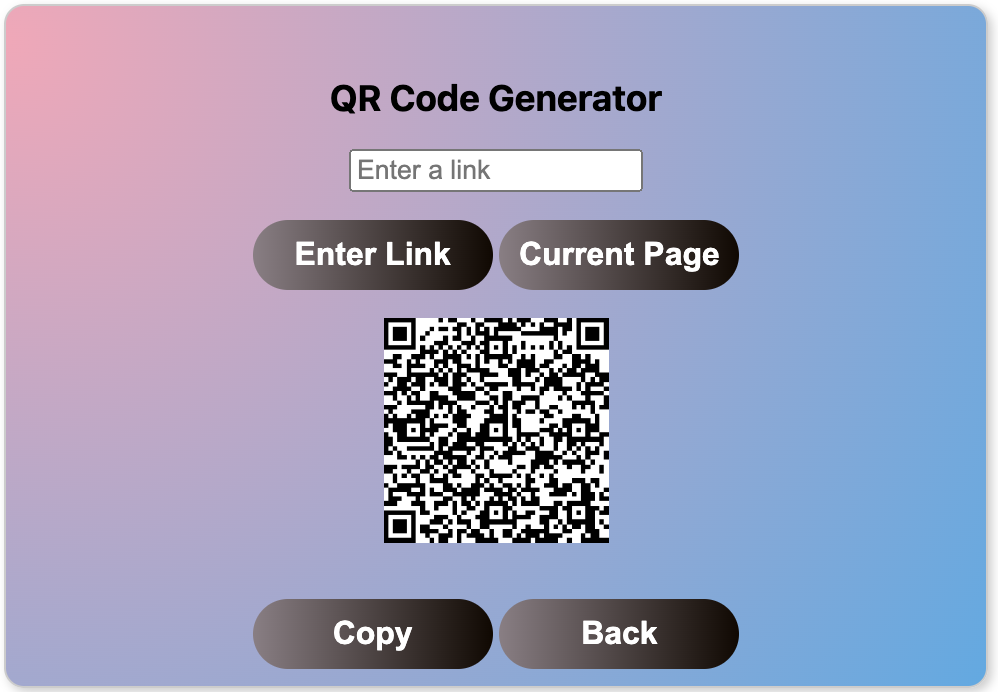
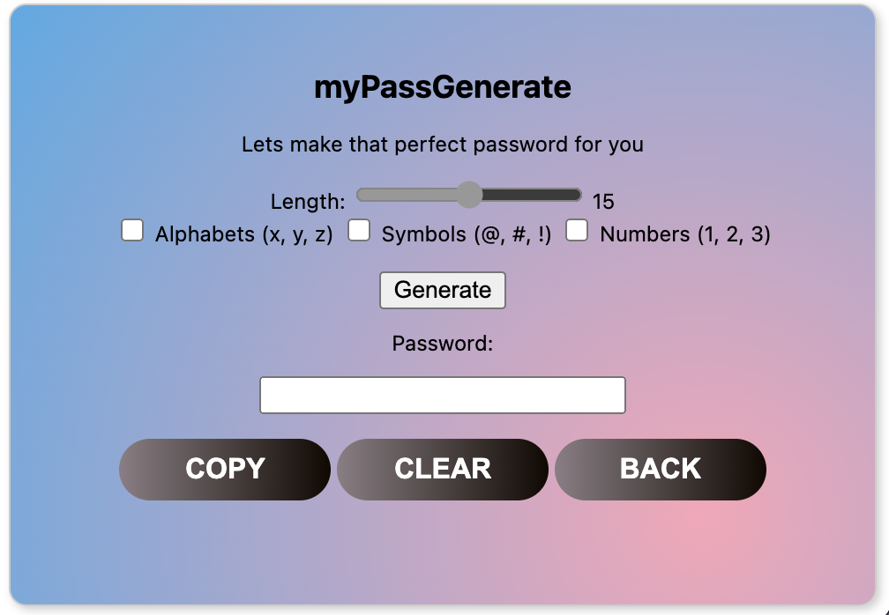

# allinOne Extension

**Version:** 1.2.5  
**Author:** Abisek

## Description

This is an extension that enhances your browsing experience by providing multiple features. It includes a password generator that allows you to customize passwords based on your preferences, as well as a QR code generator for the current website you are on. Additionally, the extension lets you scan QR codes from your local folder.

## Features

### 1. Password Generator - `myPassGenerate`

#### Usage
- Click on the `myPassGenerate` button to access the password generator.
- Adjust the length of the password using the slider.
- Choose whether to include alphabets, symbols, and numbers.
- Click the `Generate` button to generate a password.
- The generated password will be displayed and can be copied to the clipboard.

### 2. QR Code Generator - `qrCodeGenerate`

#### Usage
- Click on the `qrCodeGenerate` button to access the QR code generator.
- Enter a link in the provided input box.
- Click the `Enter Link` button to generate a QR code for the entered link.
- Alternatively, click the `Current Page` button to generate a QR code for the current webpage.
- The generated QR code will be displayed and can be copied or downloaded.

### 3. QR Code Scanner - `QRscanner`

#### Usage
- Click on the `QRscanner` button to access the QR code scanner.
- Scan a QR code from your local folder.
- The scanned information will be displayed.

## Installation

1. Clone the repository.
   ```bash
   git clone https://github.com/your-username/allinOne-Extension.git
   ```

2. Load the extension in Chrome or Edge.
   - Open the browser and go to `chrome://extensions/` or `edge://extensions/`.
   - Enable "Developer mode."
   - Click "Load unpacked" and select the cloned repository folder.

## Screenshots

### Landing Page



### QR Code Generator


### Password Generator


## License

This project is licensed under the MIT License - see the [LICENSE.md](LICENSE.md) file for details.

## Acknowledgments

- Thanks to the developers of [qrcode.js](https://davidshimjs.github.io/qrcodejs/) for the QR code generation library.

Feel free to contribute or report issues!
